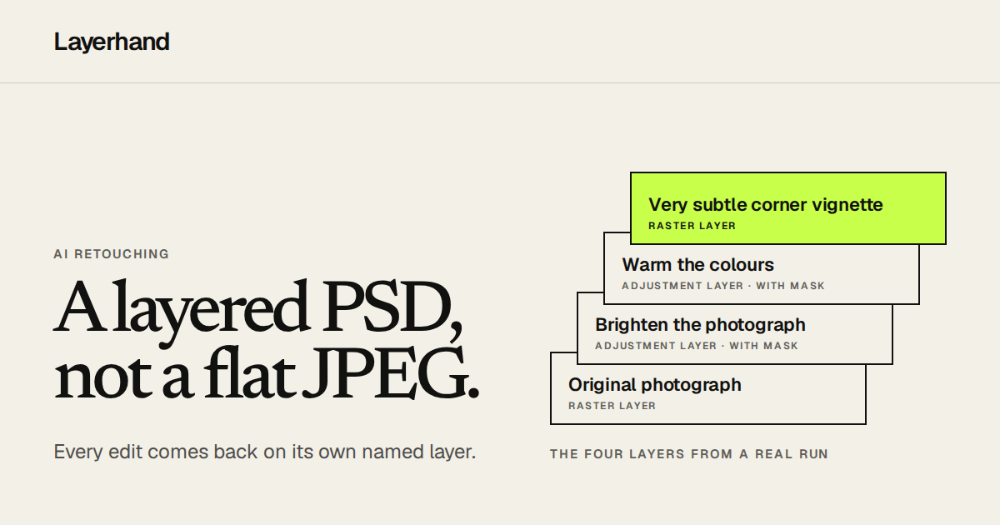
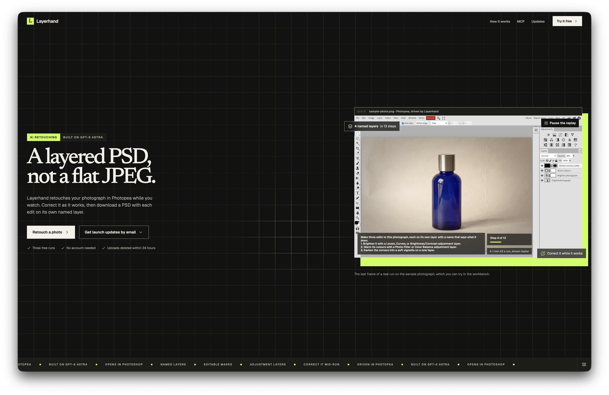
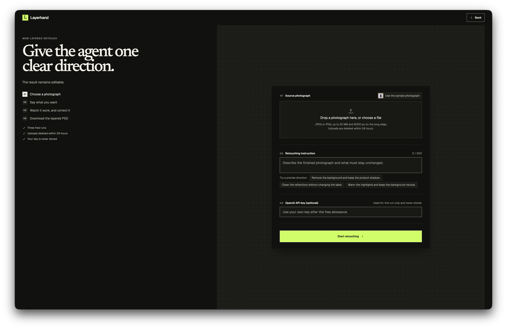
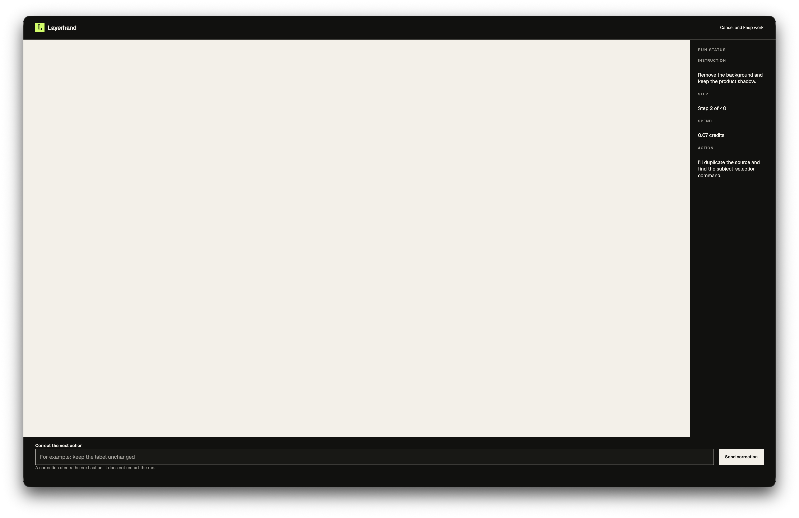
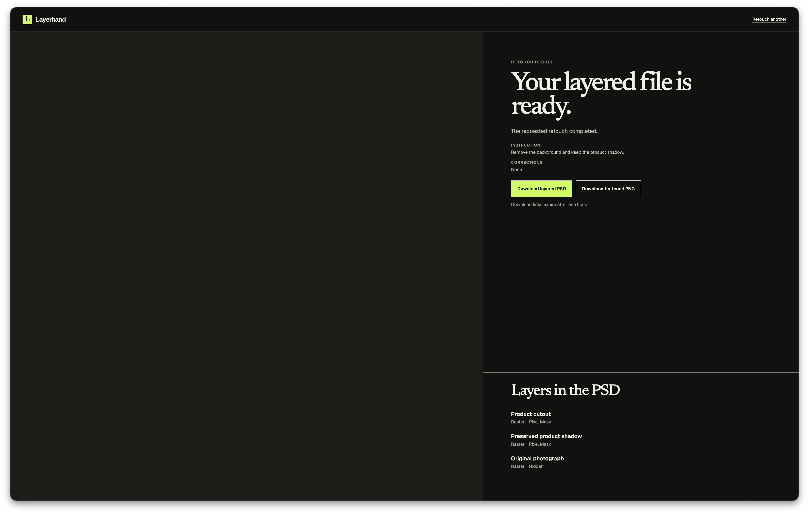
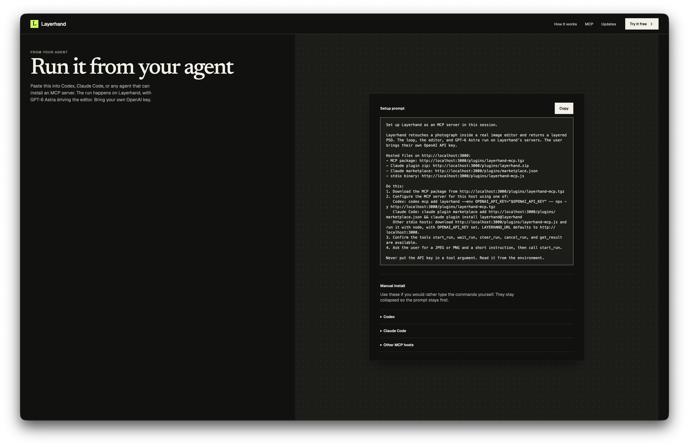
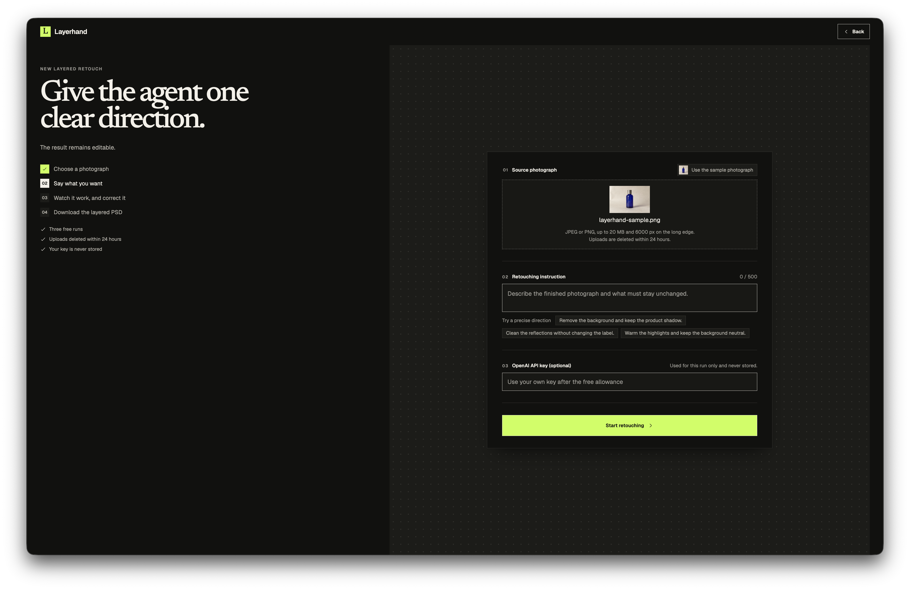
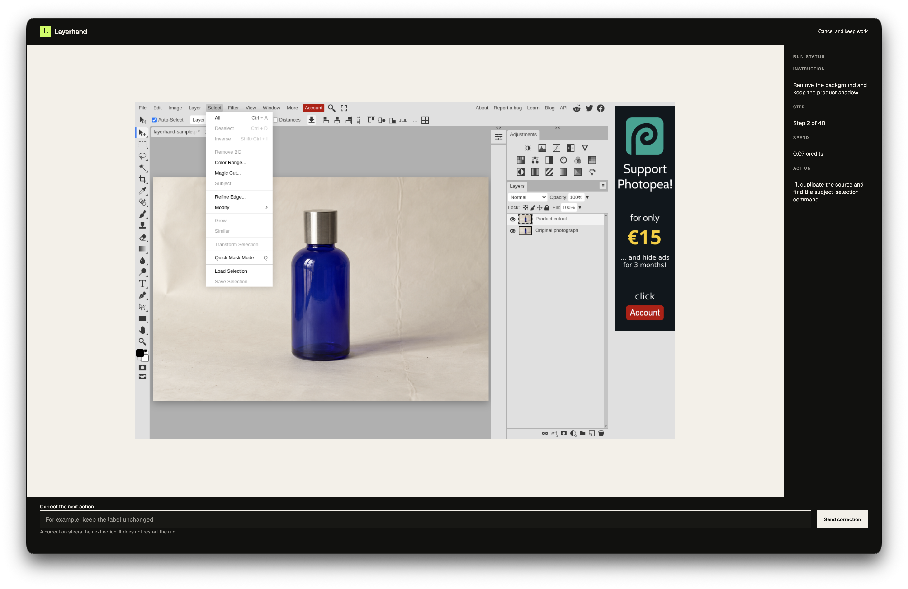
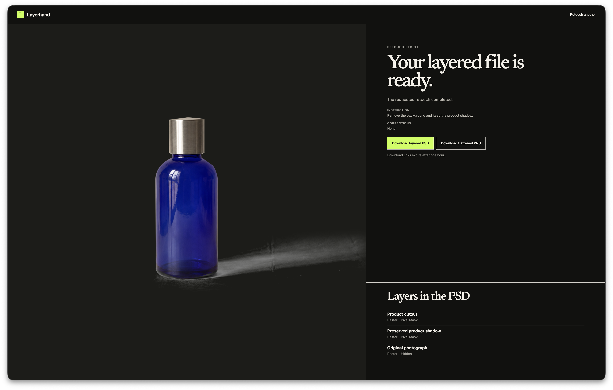
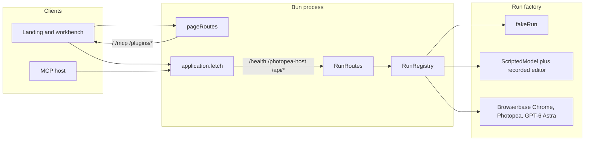

<a id="readme-top"></a>

<!-- PROJECT LOGO -->

<br />
<div align="center">
  <a href="https://github.com/M1KUAPP/Layerhand">
    
  </a>

  <h3>Layerhand</h3>

  <p>
    AI retouching that returns a layered PSD, not a flat JPEG.
    <br />
    <a href="https://layerhand-732371853772.us-central1.run.app"><strong>Live Demo »</strong></a>
    &middot;
    <a href="https://layerhand-732371853772.us-central1.run.app/mcp">MCP</a>
    &middot;
    <a href="https://github.com/M1KUAPP/Layerhand">Source</a>
    <br />
  </p>

[![Bun][Bun]][Bun-url]
[![TypeScript][TypeScript]][TypeScript-url]
[![Playwright][Playwright]][Playwright-url]
[![Three.js][Three.js]][Three-url]
[![MCP][MCP]][MCP-url]

</div>

<!-- TABLE OF CONTENTS -->

## Table of Contents

<details>
  <summary>Expand</summary>
  <ol>
    <li>
      <a href="#about-the-project">About The Project</a>
      <ul>
        <li><a href="#screenshots">Screenshots</a></li>
        <li><a href="#how-it-works">How It Works</a></li>
        <li><a href="#features">Features</a></li>
        <li><a href="#architecture">Architecture</a></li>
        <li><a href="#tech-stack">Tech Stack</a></li>
      </ul>
    </li>
    <li>
      <a href="#getting-started">Getting Started</a>
      <ul>
        <li><a href="#prerequisites">Prerequisites</a></li>
        <li><a href="#installation">Installation</a></li>
      </ul>
    </li>
    <li><a href="#roadmap">Roadmap</a></li>
    <li><a href="#team">Team</a></li>
    <li><a href="#license">License</a></li>
    <li><a href="#acknowledgments">Acknowledgments</a></li>
  </ol>
</details>

<!-- ABOUT THE PROJECT -->

## About The Project

Layerhand retouches a photograph inside [Photopea](https://www.photopea.com/), a real image editor, while you watch. GPT-6 Astra operates the editor the way a retoucher would. You can type a correction mid-run. The download is a layered PSD — named layers, masks, and adjustments still editable — plus a flattened PNG preview. It is not a generated image and not a baked-in JPEG.

The product is a desktop workbench (1280 px and up) and an MCP server for Codex, Claude Code, and other hosts. Three free runs, no account. After that, paste your own OpenAI API key; it is used for that run only and never stored. Uploads are deleted within 24 hours.

Built on GPT-6 Astra for the [GPT-6 Astra Challenge](https://www.producthunt.com/contests/gpt-6-astra-challenge).

<p align="right"><a href="#readme-top">&uarr;</a></p>

### Screenshots

|               Landing               |                Workbench                |
| :---------------------------------: | :-------------------------------------: |
|  |  |

|               Live run                |                  Layered result                   |
| :-----------------------------------: | :-----------------------------------------------: |
|  |  |

|             MCP             |
| :-------------------------: |
|  |

<p align="right"><a href="#readme-top">&uarr;</a></p>

### How It Works

Four steps on the site, and you can step in on the third.

1. **Drop in a photograph.** JPEG or PNG, up to 20 MB and 6000 px on the long edge. Arrived without one? Start from the sample bottle.

   

2. **Say what you want.** Plain words, up to 500 characters: brighten it, warm the colours, darken the corners. The workbench title is “Give the agent one clear direction.”

   

3. **Watch it work, and correct it.** GPT-6 Astra drives Photopea. Type a correction while it runs; the next steps bend, without starting over. It cannot undo a step already taken, but it can repair one.

   

4. **Download the layered PSD.** Every edit arrives on its own named layer, its mask and adjustment still editable. A flattened PNG comes with it to preview. Open the file in Photoshop, Affinity Photo, GIMP, or back in Photopea.

   

**From your agent.** Paste the setup prompt on [`/mcp`](https://layerhand-732371853772.us-central1.run.app/mcp) into Codex, Claude Code, or any MCP host. Bring your own OpenAI key. The run still happens on Layerhand.

<p align="right"><a href="#readme-top">&uarr;</a></p>

### Features

- Layered PSD output, not a flat JPEG — named layers, editable masks, adjustment layers
- GPT-6 Astra drives Photopea; you watch the live editor
- Mid-run corrections, acknowledged on the page, without restarting
- Partial layered file if a run hits its cap, is cancelled, or stops early
- Three free runs, no account; optional OpenAI key after the allowance
- JPEG or PNG uploads, 20 MB / 6000 px; sample photograph on the workbench
- Uploads deleted within 24 hours; download links expire after one hour
- MCP tools: `start_run`, `wait_run`, `steer_run`, `cancel_run`, `get_result`
- Hosted install files at `/plugins/layerhand-mcp.tgz`, `/plugins/layerhand.zip`, `/plugins/marketplace.json`, `/plugins/layerhand-mcp.js`

<p align="right"><a href="#readme-top">&uarr;</a></p>

### Architecture

One long-lived Bun process (`src/server/index.ts`) serves the page and the API.



- **Pages.** `/` is the single-page app (`src/web/index.html` → `src/web/app.ts`). `/mcp` is the setup page. Plugin artifacts are packed from `packages/layerhand-mcp`.
- **Runs.** `POST /api/runs` starts a run; `GET /api/runs/:id/events` streams progress; `POST .../steer` and `POST .../cancel` apply during the run. Uploads go to `POST /api/uploads`.
- **Modes.** `RUN_MODE` is `fake` (default), `scripted`, or `agent`. Fake is a timed script so the workbench can be built without a key or a browser. Agent mode needs `BROWSERBASE_API_KEY` and `PUBLIC_URL` so Browserbase can load `/photopea-host`.
- **MCP.** `packages/layerhand-mcp` is a stdio MCP server. It reads `OPENAI_API_KEY` from the environment (never from a tool argument) and calls the same HTTP API. `LAYERHAND_URL` defaults to the public service.

<p align="right"><a href="#readme-top">&uarr;</a></p>

### Tech Stack

- [Bun](https://bun.sh/) 1.4.2 — runtime, bundler, tests, and `bun --hot` for `bun run dev`
- TypeScript — server, agent, editor, and page
- Vanilla page — `src/web/app.ts` plus landing modules; no React
- [Photopea](https://www.photopea.com/) — the image editor the agent drives
- [Playwright](https://playwright.dev/) (`playwright-core`) — Chrome over CDP in agent mode
- [three.js](https://threejs.org/) — the landing “Still yours to edit.” glass object
- [ag-psd](https://github.com/Agamnentzar/ag-psd) — Photoshop document support
- [Model Context Protocol](https://modelcontextprotocol.io/) — `packages/layerhand-mcp`

<p align="right"><a href="#readme-top">&uarr;</a></p>

<!-- GETTING STARTED -->

## Getting Started

Local development defaults to a fake session: no API keys, no Browserbase, in-memory database. The workbench still walks the four steps, so you can take screenshots against `http://localhost:3000`.

<p align="right"><a href="#readme-top">&uarr;</a></p>

### Prerequisites

- [Bun 1.4.2](https://bun.sh/) — pinned by the production image (`oven/bun:1.4.2-alpine`) and the lockfile (version 2). Use this version for anything that talks to a browser over CDP.
- A desktop viewport at least 1280 px wide for the workbench. Narrower screens get the “Layerhand needs a wider canvas” gate.
- Optional: copy `.env.example` to `.env` only when you want `RUN_MODE=agent` or other production-like values. Fake mode does not need it.

<p align="right"><a href="#readme-top">&uarr;</a></p>

### Installation

```sh
bun install --frozen-lockfile
bun run dev
```

Open [http://localhost:3000](http://localhost:3000). Readiness is `GET /health` and returns `{ "status": "ok", "database": "ready" }` when the in-memory database has migrated.

`bun run dev` is `LAYERHAND_PAGE_RELOAD=1 bun --hot src/server/index.ts`. It reloads the page on an edit under `src/web` and serves it without the production security headers. The port is `3000` unless `PORT` is set.

`RUN_MODE` is `fake` when unset. That path runs `fakeRun()`: a short product-retouch script on a one-second step timer, with steer and cancel still wired.

To drive a real editor instead:

```sh
RUN_MODE=agent
PUBLIC_URL=http://localhost:3000
BROWSERBASE_API_KEY=...
OPENAI_API_KEY=...
```

Agent mode refuses to start without `BROWSERBASE_API_KEY` and `PUBLIC_URL`. `scripted` runs the real agent loop against a recorded editor and a scripted model, still without a live browser.

**MCP locally.** With the dev server up, open [http://localhost:3000/mcp](http://localhost:3000/mcp). The setup prompt and the Codex / Claude Code / other manuals use that origin. The five tools are `start_run`, `wait_run`, `steer_run`, `cancel_run`, and `get_result`.

**Checks.**

```sh
bun test
bun run typecheck
bun run lint
bun run build
```

`RUN_BROWSER_TESTS=1` runs the fake-backed page tests in installed Google Chrome.

<p align="right"><a href="#readme-top">&uarr;</a></p>

<!-- ROADMAP -->

## Roadmap

See [open issues](https://github.com/M1KUAPP/Layerhand/issues) for a full list of proposed features (and known issues).

<p align="right"><a href="#readme-top">&uarr;</a></p>

<!-- CONTRIBUTING -->

## Team

<a href="https://github.com/M1KUAPP/Layerhand/graphs/contributors">
  
</a>

Made with [contrib.rocks](https://contrib.rocks).

<p align="right"><a href="#readme-top">&uarr;</a></p>

<!-- LICENSE -->

## License

See [LICENSE](LICENSE) for more information.

<p align="right"><a href="#readme-top">&uarr;</a></p>

<!-- ACKNOWLEDGMENTS -->

## Acknowledgments

- [Photopea](https://www.photopea.com/) — the editor Layerhand drives; Layerhand is not affiliated with it
- [GPT-6 Astra Challenge](https://www.producthunt.com/contests/gpt-6-astra-challenge) — OpenAI × Product Hunt
- [Hugeicons](https://hugeicons.com/) — icon font on the landing and workbench
- [Canvas UI](https://canvasui.dev/) — glass object on “Still yours to edit.”
- [Shields.io](https://shields.io)
- [contrib.rocks](https://contrib.rocks)

<p align="right"><a href="#readme-top">&uarr;</a></p>

<!-- MARKDOWN LINKS & IMAGES -->

[Bun]: https://img.shields.io/badge/Bun-1.4.2-000000?style=for-the-badge&logo=bun&logoColor=f9f1e1
[Bun-url]: https://bun.sh/
[TypeScript]: https://img.shields.io/badge/TypeScript-3178C6?style=for-the-badge&logo=typescript&logoColor=white
[TypeScript-url]: https://www.typescriptlang.org/
[Playwright]: https://img.shields.io/badge/Playwright-2EAD33?style=for-the-badge&logo=playwright&logoColor=white
[Playwright-url]: https://playwright.dev/
[Three.js]: https://img.shields.io/badge/three.js-000000?style=for-the-badge&logo=threedotjs&logoColor=white
[Three-url]: https://threejs.org/
[MCP]: https://img.shields.io/badge/MCP-555555?style=for-the-badge
[MCP-url]: https://modelcontextprotocol.io/
