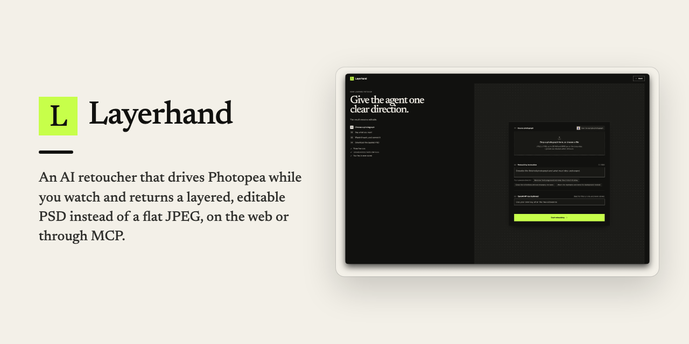
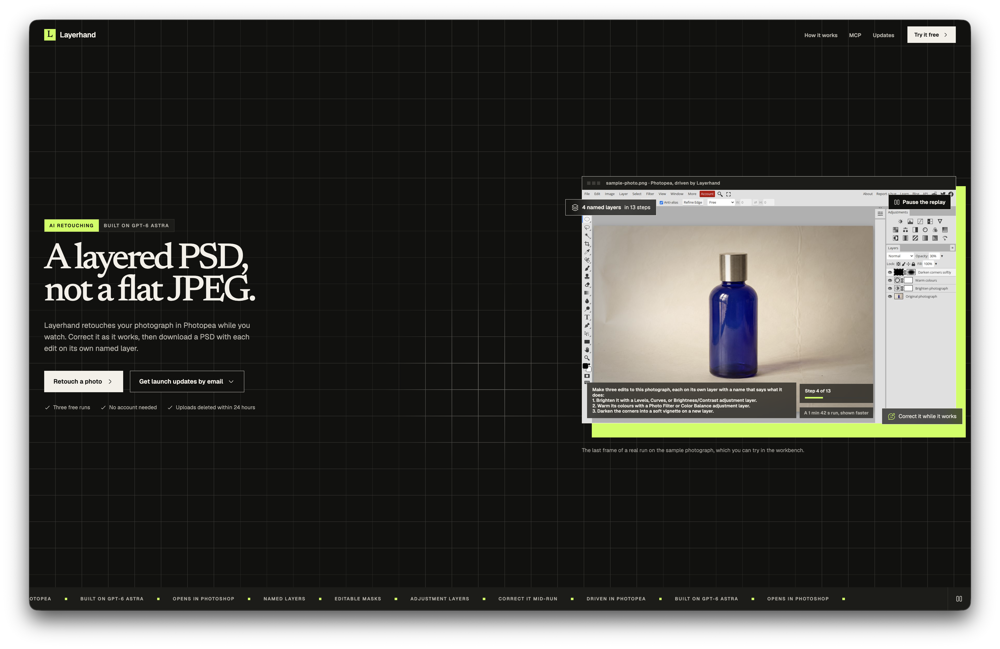
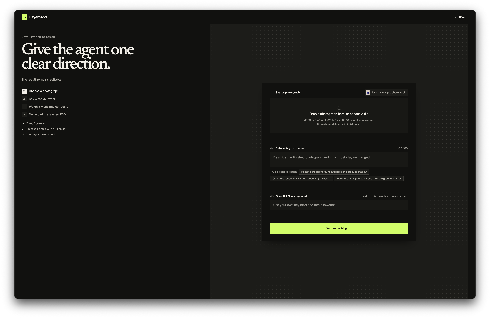
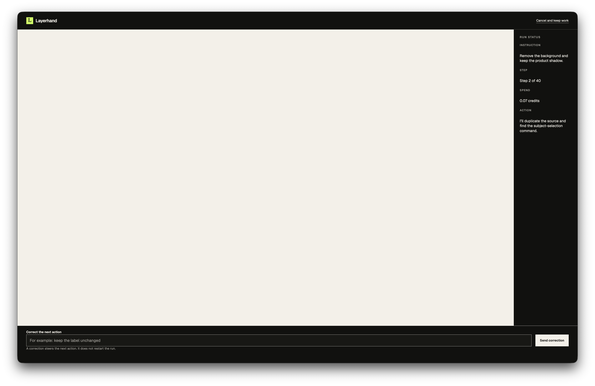
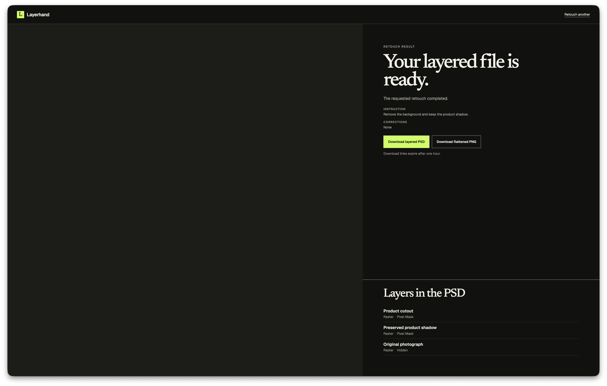
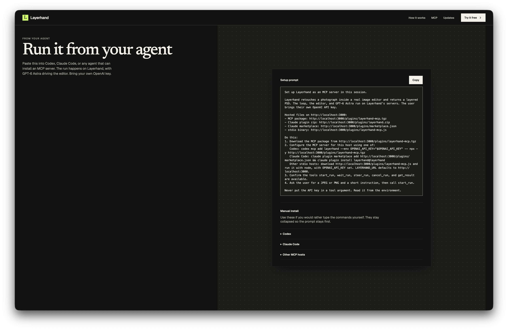
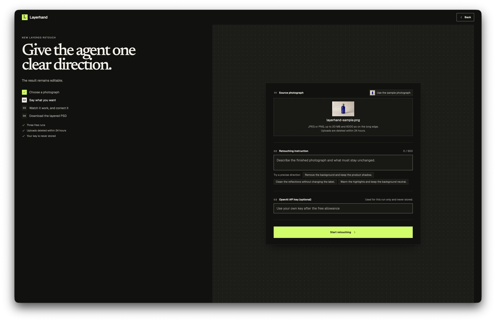
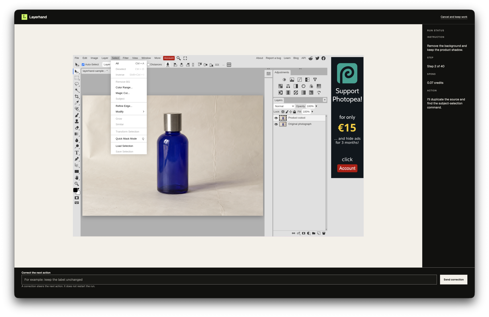
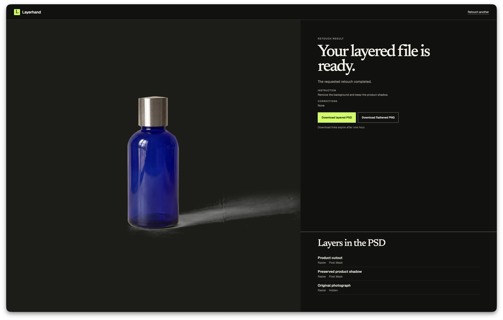

<a id="readme-top"></a>

<!-- PROJECT LOGO -->

<br />
<div align="center">
  <a href="https://github.com/M1KUAPP/Layerhand">
    <picture>
      <source media="(prefers-color-scheme: dark)" srcset="docs/readme/banner-dark.png">
      
    </picture>
  </a>

  <h3>Layerhand</h3>

  <p>
    An AI retoucher that drives Photopea while you watch and returns a layered, editable PSD instead of a flat JPEG, on the web or through MCP.
    <br />
    <a href="#getting-started"><strong>Run Locally »</strong></a>
    &middot;
    <a href="#screenshots">Screenshots</a>
    &middot;
    <a href="https://github.com/M1KUAPP/Layerhand/issues/new?labels=bug">Report a Bug</a>
    <br />
  </p>

[![TypeScript][typescript-badge]][typescript-url]
[![Three.js][threejs-badge]][threejs-url]
[![Bun][bun-badge]][bun-url]
[![Playwright][playwright-badge]][playwright-url]
[![PostgreSQL][postgresql-badge]][postgresql-url]
[![Google Cloud Storage][googlecloudstorage-badge]][googlecloudstorage-url]
[![OpenAI][openai-badge]][openai-url]
[![Model Context Protocol][modelcontextprotocol-badge]][modelcontextprotocol-url]
[![Photopea][photopea-badge]][photopea-url]
[![Browserbase][browserbase-badge]][browserbase-url]
[![Docker][docker-badge]][docker-url]
[![Cloud Run][cloudrun-badge]][cloudrun-url]
[![Prettier][prettier-badge]][prettier-url]

</div>

<!-- TABLE OF CONTENTS -->

## Table of Contents

<details>
  <summary>Expand</summary>
  <ol>
    <li>
      <a href="#about-the-project">About The Project</a>
      <ul>
        <li><a href="#screenshots">Screenshots</a></li>
        <li><a href="#how-it-works">How It Works</a></li>
        <li><a href="#features">Features</a></li>
        <li><a href="#architecture">Architecture</a></li>
        <li><a href="#tech-stack">Tech Stack</a></li>
      </ul>
    </li>
    <li>
      <a href="#getting-started">Getting Started</a>
      <ul>
        <li><a href="#prerequisites">Prerequisites</a></li>
        <li><a href="#installation">Installation</a></li>
      </ul>
    </li>
    <li><a href="#roadmap">Roadmap</a></li>
    <li><a href="#team">Team</a></li>
    <li><a href="#license">License</a></li>
    <li><a href="#acknowledgments">Acknowledgments</a></li>
  </ol>
</details>

<!-- ABOUT THE PROJECT -->

## About The Project

AI retouching that returns a layered PSD, not a flat JPEG. Layerhand retouches a photograph inside [Photopea](https://www.photopea.com/), a real image editor, while you watch. GPT-6 Astra operates the editor the way a retoucher would. You can type a correction mid-run. The download is a layered PSD — named layers, masks, and adjustments still editable — plus a flattened PNG preview. It is not a generated image and not a baked-in JPEG.

The product is a desktop workbench (1280 px and up) and an MCP server for Codex, Claude Code, and other hosts. Three free runs, no account. After that, paste your own OpenAI API key; it is used for that run only and never stored. Uploads are deleted within 24 hours.

Built for [GPT-6 Astra Challenge](https://www.producthunt.com/contests/gpt-6-astra-challenge).

<p align="right"><a href="#readme-top">&uarr;</a></p>

### Screenshots

<table>
  <tr>
    <td width="50%" valign="top" align="left">
      
      <br />
      <strong>Landing</strong> · The home page pitches a layered PSD, not a flat JPEG, with three free runs.
    </td>
    <td width="50%" valign="top" align="left">
      
      <br />
      <strong>Workbench</strong> · Drop in a photograph, say what you want, and optionally add an OpenAI key.
    </td>
  </tr>
  <tr>
    <td width="50%" valign="top" align="left">
      
      <br />
      <strong>Live Run</strong> · GPT-6 Astra drives Photopea while you type a correction without restarting the run.
    </td>
    <td width="50%" valign="top" align="left">
      
      <br />
      <strong>Layered Result</strong> · Download the layered PSD and a flattened PNG preview, with every named layer listed.
    </td>
  </tr>
  <tr>
    <td width="50%" valign="top" align="left">
      
      <br />
      <strong>MCP</strong> · Paste the setup prompt into Codex, Claude Code, or any MCP host.
    </td>
    <td width="50%" valign="top" align="left">
    </td>
  </tr>
</table>

<p align="right"><a href="#readme-top">&uarr;</a></p>

### How It Works

1. **Drop in a photograph.** JPEG or PNG, up to 20 MB and 6000 px on the long edge. Arrived without one? Start from the sample bottle.

   

2. **Say what you want.** Plain words, up to 500 characters: brighten it, warm the colors, darken the corners. The workbench title is “Give the agent one clear direction.”

   

3. **Watch it work, and correct it.** GPT-6 Astra drives Photopea. Type a correction while it runs; the next steps bend, without starting over. It cannot undo a step already taken, but it can repair one.

   

4. **Download the layered PSD.** Every edit arrives on its own named layer, its mask and adjustment still editable. A flattened PNG comes with it to preview. Open the file in Photoshop, Affinity Photo, GIMP, or back in Photopea.

   

<p align="right"><a href="#readme-top">&uarr;</a></p>

### Features

- **Layered PSD output.** Not a flat JPEG: named layers, editable masks, and adjustment layers.
- **Live editor.** GPT-6 Astra drives Photopea while you watch the live editor.
- **Mid-run corrections.** Corrections are acknowledged on the page, without restarting.
- **Partial results.** A run that hits its cap, is canceled, or stops early still returns a partial layered file.
- **Free runs.** Three free runs, no account; an optional OpenAI key after the allowance.
- **Uploads.** JPEG or PNG uploads, 20 MB / 6000 px, with a sample photograph on the workbench.
- **Short retention.** Uploads are deleted within 24 hours; download links expire after one hour.
- **From your agent.** Paste the setup prompt on [`/mcp`](https://layerhand-732371853772.us-central1.run.app/mcp) into Codex, Claude Code, or any MCP host, and bring your own OpenAI key; the run still happens on Layerhand. The MCP tools are `start_run`, `wait_run`, `steer_run`, `cancel_run`, and `get_result`.
- **Hosted install files.** Served at `/plugins/layerhand-mcp.tgz`, `/plugins/layerhand.zip`, `/plugins/marketplace.json`, and `/plugins/layerhand-mcp.js`.

<p align="right"><a href="#readme-top">&uarr;</a></p>

### Architecture

<picture>
  <source media="(prefers-color-scheme: dark)" srcset="docs/readme/architecture-dark.svg">
  
</picture>

The diagram is drawn with [archify](https://github.com/tt-a1i/archify) from [`architecture.json`](docs/readme/architecture.json).

One long-lived Bun process (`src/server/index.ts`) serves the page and the API.

- **Pages.** `/` is the single-page app (`src/web/index.html` → `src/web/app.ts`). `/mcp` is the setup page. Plugin artifacts are packed from `packages/layerhand-mcp`.
- **Runs.** `POST /api/runs` starts a run; `GET /api/runs/:id/events` streams progress; `POST .../steer` and `POST .../cancel` apply during the run. Uploads go to `POST /api/uploads`.
- **Modes.** `RUN_MODE` is `fake` (default), `scripted`, or `agent`. Fake is a timed script so the workbench can be built without a key or a browser. Agent mode needs `BROWSERBASE_API_KEY` and `PUBLIC_URL` so Browserbase can load `/photopea-host`.
- **MCP.** `packages/layerhand-mcp` is a stdio MCP server. It reads `OPENAI_API_KEY` from the environment (never from a tool argument) and calls the same HTTP API. `LAYERHAND_URL` defaults to the public service.

<p align="right"><a href="#readme-top">&uarr;</a></p>

### Tech Stack

- **Languages:** TypeScript for the server, agent, editor, and page.
- **Frontend:** a vanilla page (`src/web/app.ts` plus landing modules; no React), and [three.js](https://threejs.org/) for the landing “Still yours to edit.” glass object.
- **Backend:** [Bun](https://bun.sh/) 1.4.2 as the runtime and bundler, with `bun --hot` for `bun run dev`; [Playwright](https://playwright.dev/) (`playwright-core`) for Chrome over CDP in agent mode; [ag-psd](https://github.com/Agamnentzar/ag-psd) for Photoshop document support; and a [Model Context Protocol](https://modelcontextprotocol.io/) server in `packages/layerhand-mcp`.
- **Data:** [PostgreSQL](https://www.postgresql.org/) and [Google Cloud Storage](https://cloud.google.com/storage).
- **AI and services:** [OpenAI](https://openai.com/) GPT-6 Astra through the Responses API, [Photopea](https://www.photopea.com/) as the image editor the agent drives, and [Browserbase](https://www.browserbase.com/) for hosted Chrome.
- **Infrastructure:** [Docker](https://www.docker.com/) (`oven/bun:1.4.2-alpine`) and [Cloud Run](https://cloud.google.com/run).
- **Tooling:** Bun's test runner for tests, and [Prettier](https://prettier.io/).

<p align="right"><a href="#readme-top">&uarr;</a></p>

<!-- GETTING STARTED -->

## Getting Started

Local development defaults to a fake session: no API keys, no Browserbase, in-memory database.

<p align="right"><a href="#readme-top">&uarr;</a></p>

### Prerequisites

- [Bun](https://bun.sh/) 1.4.2 — pinned by the production image (`oven/bun:1.4.2-alpine`) and the lockfile (version 2). Use this version for anything that talks to a browser over CDP.
- [Google Chrome](https://www.google.com/chrome/) — or another desktop browser, with a viewport at least 1280 px wide for the workbench. Narrower screens get the “Layerhand needs a wider canvas” gate.
- [Python](https://www.python.org/) 3 — runs the demo recorder's tests in `bun run check`, with the standard library only.

<p align="right"><a href="#readme-top">&uarr;</a></p>

### Installation

1. **Install the dependencies.**

   ```sh
   bun install --frozen-lockfile
   ```

2. **Start the dev server.** `bun run dev` is `LAYERHAND_PAGE_RELOAD=1 bun --hot src/server/index.ts`. It reloads the page on an edit under `src/web` and serves it without the production security headers. The port is `3000` unless `PORT` is set.

   ```sh
   bun run dev
   ```

   `RUN_MODE` is `fake` when unset. That path runs `fakeRun()`: a short product-retouch script on a one-second step timer, with steer and cancel still wired.

3. **Open the workbench.** Open [http://localhost:3000](http://localhost:3000). The workbench still walks the four steps, so you can take screenshots against it. Readiness is `GET /health` and returns `{ "status": "ok", "database": "ready" }` when the in-memory database has migrated.

4. **Optionally, drive a real editor.** Copy `.env.example` to `.env` only when you want `RUN_MODE=agent` or other production-like values; fake mode does not need it. To drive a real editor instead, set:

   ```sh
   RUN_MODE=agent
   PUBLIC_URL=http://localhost:3000
   BROWSERBASE_API_KEY=...
   OPENAI_API_KEY=...
   ```

   Agent mode refuses to start without `BROWSERBASE_API_KEY` and `PUBLIC_URL`. `scripted` runs the real agent loop against a recorded editor and a scripted model, still without a live browser.

5. **Try MCP locally.** With the dev server up, open [http://localhost:3000/mcp](http://localhost:3000/mcp). The setup prompt and the Codex / Claude Code / other manuals use that origin. The five tools are `start_run`, `wait_run`, `steer_run`, `cancel_run`, and `get_result`.

6. **Run the checks.** `bun run check` runs the lint, the typecheck and the tests, including the MCP package's and the demo recorder's Python tests. `bun run build` builds the production bundle separately.

   ```sh
   bun run check
   ```

   `RUN_BROWSER_TESTS=1` runs the fake-backed page tests in installed Google Chrome.

<p align="right"><a href="#readme-top">&uarr;</a></p>

<!-- ROADMAP -->

## Roadmap

See [open issues](https://github.com/M1KUAPP/Layerhand/issues) for a full list of proposed features (and known issues).

<p align="right"><a href="#readme-top">&uarr;</a></p>

<!-- CONTRIBUTING -->

## Team

<a href="https://github.com/M1KUAPP/Layerhand/graphs/contributors">
  
</a>

Made with [contrib.rocks](https://contrib.rocks).

<p align="right"><a href="#readme-top">&uarr;</a></p>

<!-- LICENSE -->

## License

See [LICENSE](LICENSE) for more information.

<p align="right"><a href="#readme-top">&uarr;</a></p>

<!-- ACKNOWLEDGMENTS -->

## Acknowledgments

- [Photopea](https://www.photopea.com/) — the editor Layerhand drives; Layerhand is not affiliated with it.
- [GPT-6 Astra Challenge](https://www.producthunt.com/contests/gpt-6-astra-challenge) — OpenAI × Product Hunt.
- [Hugeicons](https://hugeicons.com/) — icon font on the landing and workbench.
- [Canvas UI](https://canvasui.dev/) — glass object on “Still yours to edit.”
- [archify](https://github.com/tt-a1i/archify) — architecture diagrams.
- [Shields.io](https://shields.io)
- [contrib.rocks](https://contrib.rocks)

<p align="right"><a href="#readme-top">&uarr;</a></p>

<!-- MARKDOWN LINKS & IMAGES -->

[typescript-badge]: https://img.shields.io/badge/TypeScript-3178C6?style=for-the-badge&logo=typescript&logoColor=white
[typescript-url]: https://www.typescriptlang.org/
[threejs-badge]: https://img.shields.io/badge/Three.js-000000?style=for-the-badge&logo=threedotjs&logoColor=white
[threejs-url]: https://threejs.org/
[bun-badge]: https://img.shields.io/badge/Bun-000000?style=for-the-badge&logo=bun&logoColor=white
[bun-url]: https://bun.sh/
[playwright-badge]: https://img.shields.io/badge/Playwright-2EAD33?style=for-the-badge
[playwright-url]: https://playwright.dev/
[postgresql-badge]: https://img.shields.io/badge/PostgreSQL-4169E1?style=for-the-badge&logo=postgresql&logoColor=white
[postgresql-url]: https://www.postgresql.org/
[googlecloudstorage-badge]: https://img.shields.io/badge/Google_Cloud_Storage-AECBFA?style=for-the-badge&logo=googlecloudstorage&logoColor=black
[googlecloudstorage-url]: https://cloud.google.com/storage
[openai-badge]: https://img.shields.io/badge/OpenAI-412991?style=for-the-badge
[openai-url]: https://openai.com/
[modelcontextprotocol-badge]: https://img.shields.io/badge/Model_Context_Protocol-000000?style=for-the-badge&logo=modelcontextprotocol&logoColor=white
[modelcontextprotocol-url]: https://modelcontextprotocol.io/
[photopea-badge]: https://img.shields.io/badge/Photopea-18A497?style=for-the-badge&logo=photopea&logoColor=white
[photopea-url]: https://www.photopea.com/
[browserbase-badge]: https://img.shields.io/badge/Browserbase-FF4500?style=for-the-badge
[browserbase-url]: https://www.browserbase.com/
[docker-badge]: https://img.shields.io/badge/Docker-2496ED?style=for-the-badge&logo=docker&logoColor=white
[docker-url]: https://www.docker.com/
[cloudrun-badge]: https://img.shields.io/badge/Cloud_Run-4285F4?style=for-the-badge&logo=googlecloud&logoColor=white
[cloudrun-url]: https://cloud.google.com/run
[prettier-badge]: https://img.shields.io/badge/Prettier-F7B93E?style=for-the-badge&logo=prettier&logoColor=black
[prettier-url]: https://prettier.io/
